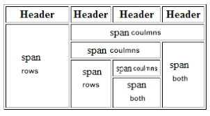

# ITEXT7: Java Library for creating pdf files
Wanna see the [source code](https://github.com/itext/itext7/tree/develop)
Wanna know what are all the Border options? 

## Structure
Paragraph Object vs Text Object? \
paragraph act like block element and text act like inline element

## Style
you can control margin, padding , rotating , width, word spacing , padding, Height, color, font weight, size etc...
1. create a style object. A container object for style properties of an element
2. call the `.addStyle(pass the style object)` on the element you want to style (Text, Paragraph)

### Font Decoration: Italic, bold, stroke, color - you need to call those methods
*italic*: `.setItalic()`\
**bold**: `.setBold()`\
underline: `.setUnderline()`\
color: `.setFontColor()`\
stroke: `.setStrokeColor(Color Enume)`
stroke only outline: `.setTextRenderingMode(PdfCanvasConstants.TextRenderingMode.STROKE).setStrokeColor(Color Enum).
setStrokeWidth(int f)` => f since it's a float\
more than one decoration: you can chain methods like `.setBold().setItalic()`\

### Customize Color
use: `new DeviceRgb(rgbvalue)` instead of: `Color.COLORNAME`

## Lists
List can be unsorted and by default tey will have a - sign before each item
1. Create a list object, it's not a Java out of the box object, it comes from
``import com.itextpdf.layout.element.List;
   ``
2. Add strings to the list with the `.add(<string>)`

### customizing the list symbol
As said, the default symbol is `-`. I change it:
1. Create a Text object and pass the [unicode](https://www.rapidtables.com/code/text/unicode-characters.html) code of the symbol.
2. apply the `.setListSymbol()` to the list you have created and pass the text object as an argument.\
If you have a font that contains only symbol, you can use it
```java
PdfFont pdfFont = PdfFontFactory.createFont(FontConstants.ZAPFDINGBATS);
Text text = new Text(<a letter>).setFont(pdfFont);
```
then follow step 2.
## Tabels
you create a table object once and that you add cells. cells are added from left to right

1. create a Table object and pass to its constructor the width of each col. as an arg
2. create Cell Object
3. on the Cell object call the add method and add a string
4. call the `.addCell()` on the table object and pass the Cell object as arg

### Add Border to table
1. Create a Border object
``Border borderObject = new GrooveBorder(<width>);``
2. Apply the `.setBorder(borderObject)` to the element you want to border (a cell, a table)

### Nesting inside a cell
1. Image: the image should fit and be small otherwise it 
can raise an exception.
2. It's done by creating the mini/nested table and adding it to a cell
3. Unordered list 

## Row / Column span
\
To create the row/coulmns span one need just to pass the span values (int) to the cell constructor\
``new Cell(<row span>, <col span>)``
